# AI Algorithm Benchmarking with Noisy Data and LW-AdaDelta Optimization

This project evaluates multiple machine learning tasks under controlled experimental settings, including noise injection and a novel optimization method (LW-AdaDelta). The goal is to analyze model robustness and performance across diverse datasets.

---

## 🎯 Objective

To benchmark algorithmic performance across multiple datasets under:
- Clean and noisy conditions
- Varying levels of data corruption
- A proposed optimization variant (LW-AdaDelta)

---

## 🧪 Experimental Overview

The project includes the following experiments:

- CIFAR-10 classification (20% noise)
- CIFAR-10 classification (40% noise)
- CIFAR-10 comparative analysis (20% vs 40%)
- ETT time-series forecasting
- California Housing prediction (with noise analysis)
- UCI HAR human activity recognition
- NYC Taxi fare prediction
- PTB-XL ECG signal classification

---

## ⚙️ Methodology

All experiments follow a consistent pipeline:
- Standardized preprocessing per dataset
- Controlled noise injection where applicable
- Consistent evaluation metrics per task
- Evaluation of LW-AdaDelta optimizer against baseline approaches

---

## 📊 Results

### 🖼️ Overall Summary
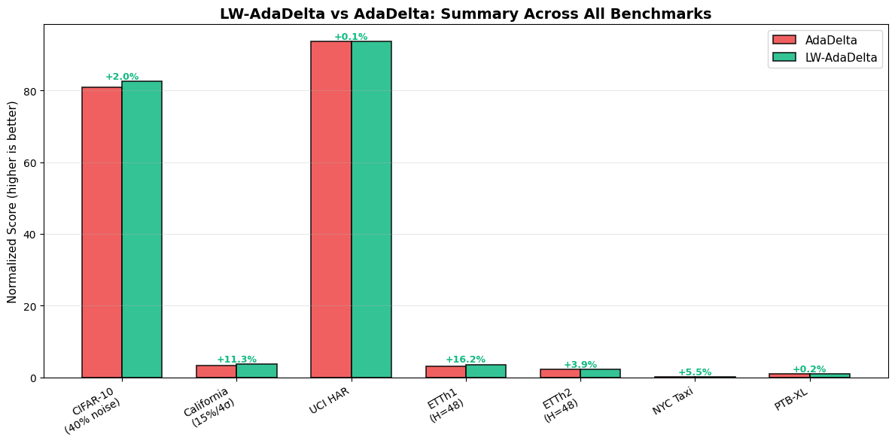

---

### 🧠 CIFAR-10 Experiments

#### 20% Noise
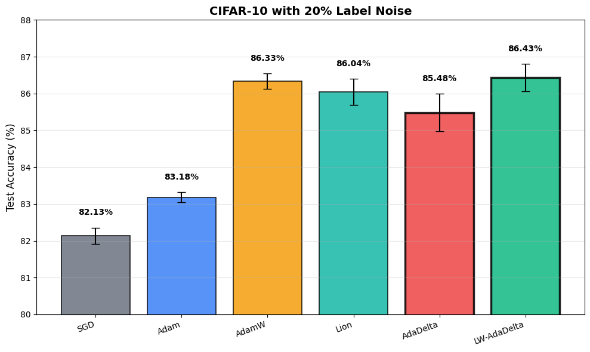

#### 20% Noise with LW-AdaDelta
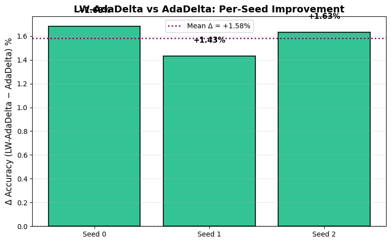

#### 40% Noise
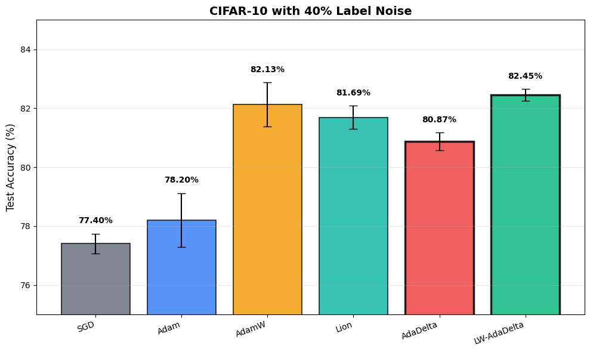

#### 20% vs 40% Comparison
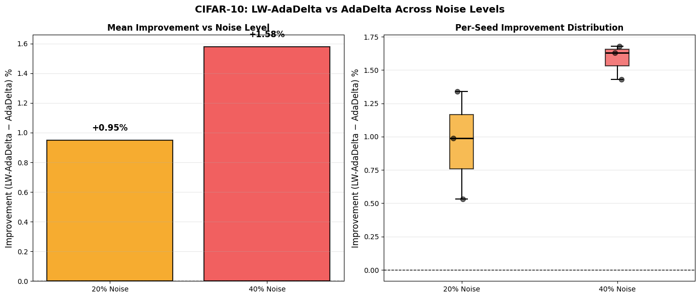

---

### 📈 ETT Time Series
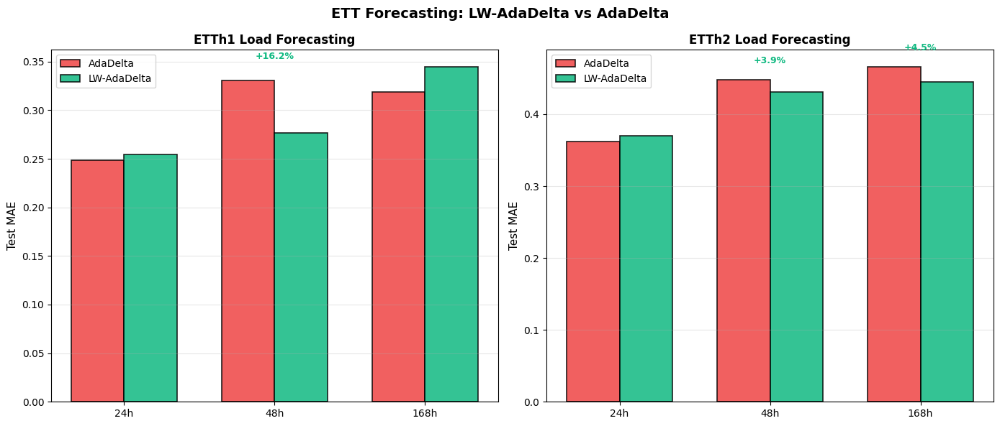

---

### 🏠 California Housing
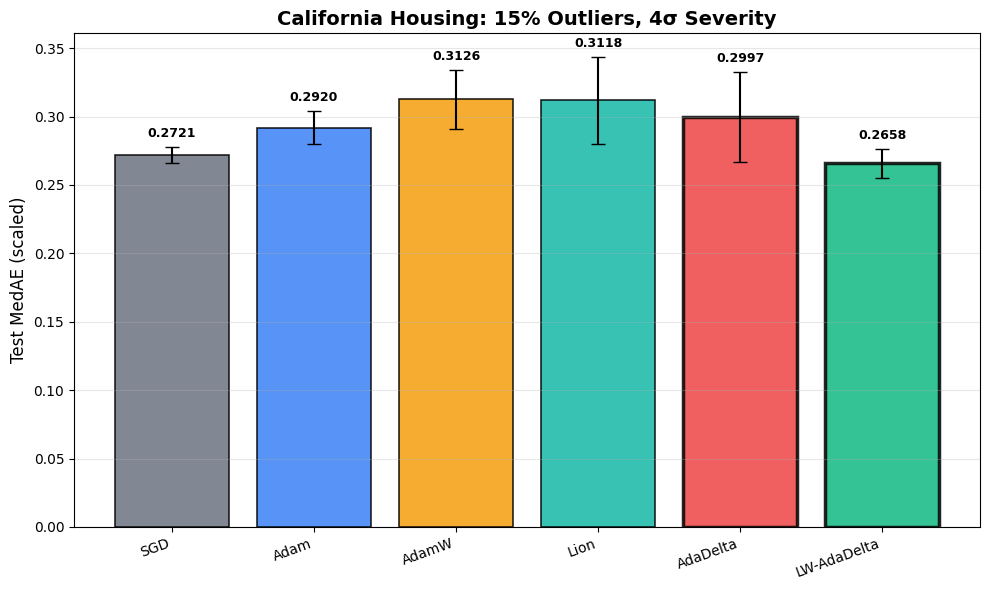

#### Heatmap Analysis
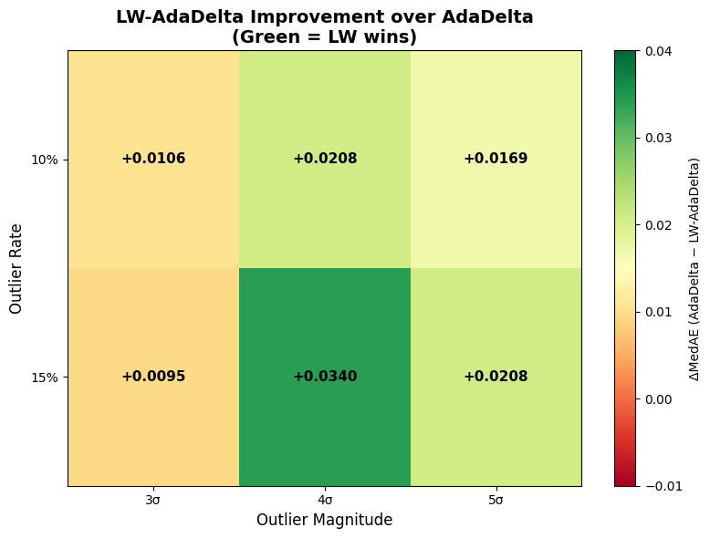

---

### 🚖 NYC Taxi Fare Prediction
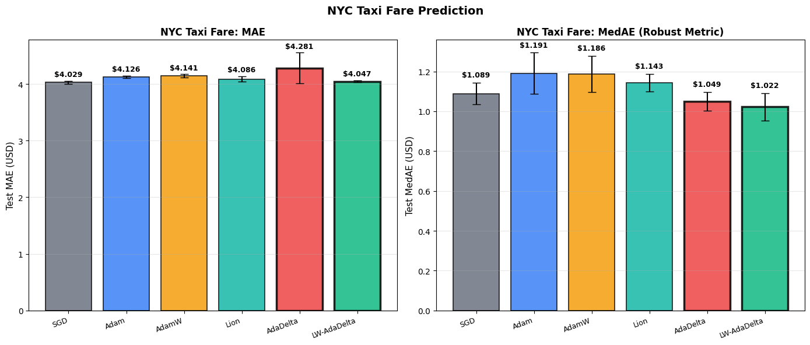

---

### 🧍 UCI HAR Dataset
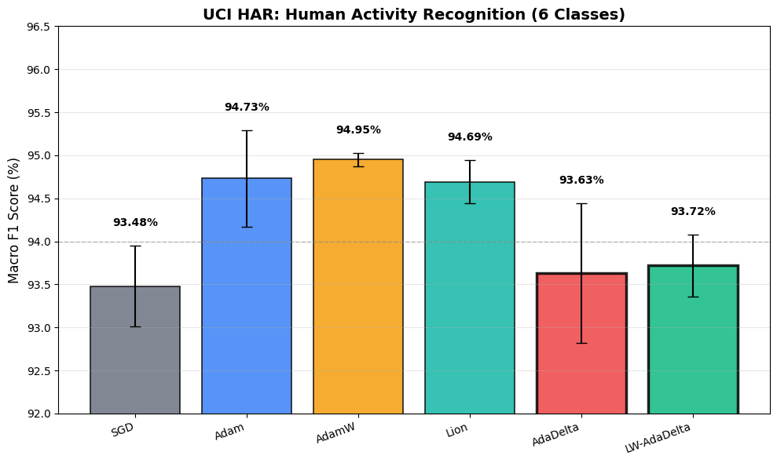

---

### ❤️ PTB-XL ECG Classification
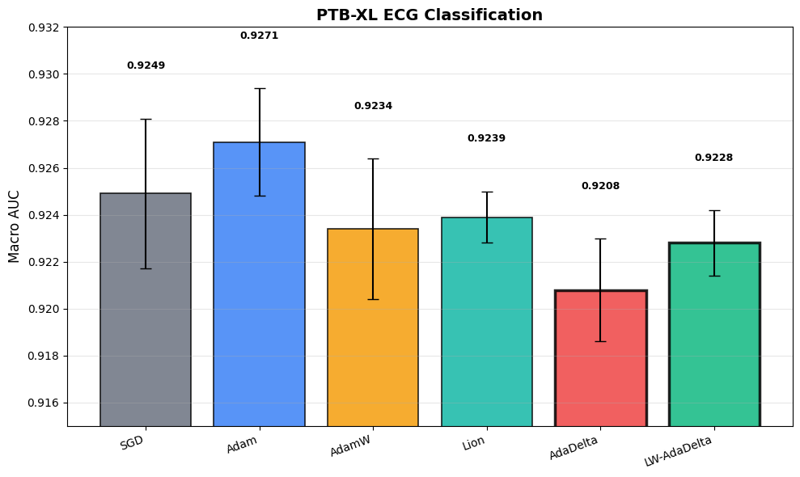

---

## 📌 Key Observations

- LW-AdaDelta improves robustness under noisy CIFAR-10 settings
- Performance degradation increases significantly from 20% → 40% noise
- Time-series datasets show higher sensitivity to noise than tabular data
- Consistent trends observed across multiple domains validate experimental setup

---

## 📄 Paper

A LaTeX draft of the paper is included:
